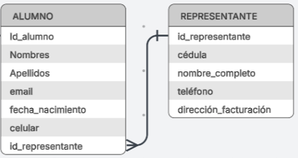

# 🏫 BASES DE DATOS RELACIONALES - CLASE 01: Elementos de una Base de Datos
**Tema:** Teoría sobre Bases de Datos Relacionales
**Autor:** Aaron Olmedo

---

## 🏗️ Estructura Básica

Para hacerlo sencillo de entender, los elementos de las bases de datos relacionales tienen jerarquías. 
Una Base de Datos (DB) puede tener una o más tablas (usualmente relacionadas entre sí).

Una **DB relacional** es cuando las tablas se conectan mediante una variable en común. Es decir, existe una misma columna que está presente en dos tablas para poder enlazarlas.

### 🍎 Ejemplo Práctico
En una DB de una escuela existen dos tablas: 
1. `ALUMNOS`
2. `CALIFICACIONES`

Para relacionar estas dos tablas, necesitamos que una misma variable esté en ambas. En este caso, la variable será `ID_ALUMNO` (que **DEBE** ser una clave única para cada estudiante).

Así, sabemos que el alumno "Juan" con `ID_ALUMNO = JUAN123` en la tabla de Alumnos, tiene **ÚNICAMENTE** las calificaciones que en la tabla de Calificaciones tienen ese mismo `ID_ALUMNO = JUAN123` (y no las de JUAN321 ni JOAN132). 

---

## 🔑 Conceptos Clave (Diccionario SQL)

* **Entidades y Atributos:** En SQL, a las tablas se las conoce como **"Entidades"** y a las columnas como **"Atributos"**.
* **Claves (Keys):** A la columna que comparten dos tablas para relacionarse se le llama "Clave".
* **Primary Key (PK - Clave Primaria):** Si la clave está en la tabla PRINCIPAL (en este caso, la de `ALUMNO`), se llama Clave Primaria. Es una PK porque *describe al alumno*; es su identificador único y no el de la calificación.
* **Foreign Key (FK - Clave Foránea):** Cuando usamos este identificador del alumno en otra tabla (la tabla "invitada"), esta PK se convierte en una Clave Foránea.

> **💡 Resumen:** Si `ID_ALUMNO` está en la entidad `ALUMNO`, se llama **PK**. Si está en la entidad `CALIFICACIONES`, se llama **FK**.

> **🚨 REGLA DE ORO PARA UNA PK:**
> Una Primary Key DEBE ser: **Única, Inalterable y NUNCA nula (`NOT NULL`)**.
> *Nota:* Una PK NO puede ser un correo electrónico, porque un usuario puede tener más de un correo o cambiarlo con el tiempo.

---

## 🔗 Relación entre Entidades

Para que las bases de datos sean verdaderamente relacionales, debe existir (por lo general) una relación de **"1 a muchos"** (1:N).

Volviendo al ejemplo anterior:
A **UN (1)** mismo alumno le corresponden **MUCHAS (N)** calificaciones.
* La **PK** está en la entidad `ALUMNO` (El lado "1").
* La **FK** está en la entidad `CALIFICACIONES` (El lado "Muchos").

*Otro ejemplo:* **UN** mismo alumno debe y puede realizar **MUCHOS** pagos; pero **UN** mismo pago NO puede ser realizado por MUCHOS alumnos.

A continuación, se observa un flujo de base de datos donde se aplica todo lo mencionado:

Se puede notar cómo las columnas se relacionan entre sí **ÚNICAMENTE DOS ENTIDADES A LA VEZ**, por medio de estas líneas. Estas líneas indican dónde se encuentra la PK (con una raya simple `|`) y dónde está la FK (la línea se divide en varias, como pata de gallo). *Esa es la relación de UNO A MUCHOS.*

### 🌉 El Efecto "Puente"

> **⚠️ IMPORTANTE:** Si queremos relacionar, por ejemplo, la entidad `REPRESENTANTE` con `PAGOS`, el camino debe ser:
> `REPRESENTANTE` ➡️ `ALUMNO` ➡️ `PAGOS`
> *(No se pueden relacionar directamente).*

Para ser más específicos:
1. La PK `ID_REPRESENTANTE` en la entidad *REPRESENTANTE*, se relaciona con la FK del mismo nombre en la entidad *ALUMNO*. 
2. Después, la PK `ID_ALUMNO` en la entidad *ALUMNO* se relaciona con la FK del mismo nombre en la entidad *PAGOS*.
